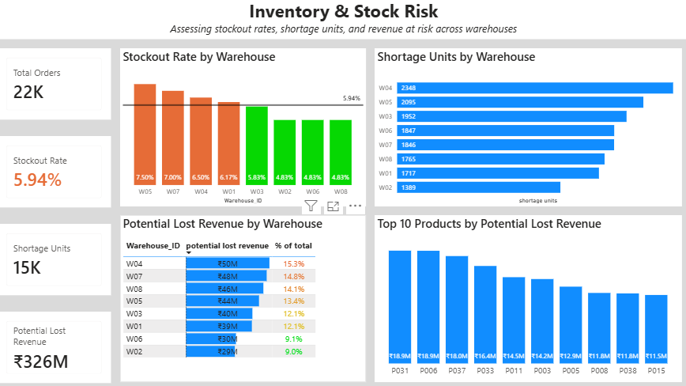
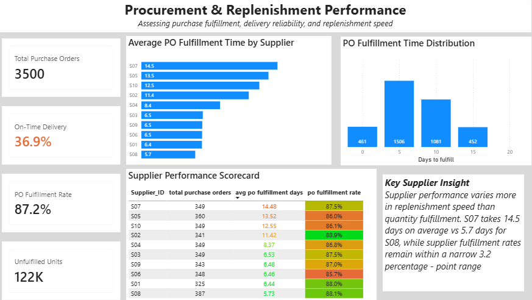

# Supply Chain & Inventory Analytics

An end-to-end **Power BI project** analyzing inventory risk, stockouts, shortages, potential lost revenue, and procurement performance across warehouses and suppliers (2025 data).

## Dashboard Preview

### Page 1: Inventory & Stock Risk

### Page 2: Procurement Performance

## Objective

Build an interactive dashboard to identify inventory and procurement issues, quantify their business impact, and highlight areas requiring attention.

## Tools

* Power BI Desktop
* Power Query
* DAX
* CSV

## Data Model

| Table               | Grain                                            |
| ------------------- | ------------------------------------------------ |
| **Orders**          | One row per order line                           |
| **Purchase Orders** | One row per unique purchase order                |
| **Shipments**       | One row per shipment                             |
| **Inventory**       | One row per product–warehouse month-end snapshot |
| **Products**        | One row per product                              |
| **Suppliers**       | One row per supplier                             |
| **Warehouses**      | One row per warehouse                            |
| **Date**            | One row per date                                 |

## Workflow

**Raw CSV Data → Power Query → Data Model → DAX Measures → Interactive Dashboard**

## Data Preparation

* Cleaned and transformed multiple tables
* Handled missing values and duplicates
* Standardized data types and categories
* Built a star schema with fact and dimension relationships
* Created a Date table
* Found duplicate PO records during validation and used **unique PO counts** for procurement analysis

## Analysis

* Warehouse stockout rates and shortage units
* Potential lost revenue by warehouse and top 10 products
* Supplier and purchase-order performance
* PO fulfillment-time distribution
* Network-average benchmarking

## Key Insights

### Page 1: Inventory & Stock Risk

* W04 has the highest shortage units (**2,348**) and the highest potential lost revenue (**₹49.8M, 15.3%** of ₹326M).
* W05 has the highest stockout rate (**7.5%**) but ranks 4th in lost revenue, so rate and revenue exposure must be tracked separately.
* **5 of 8 warehouses** exceed the network average stockout rate of **5.94%**.

### Page 2: Procurement Performance

* **3,500 unique purchase orders** analyzed.
* **On-time delivery is only 36.9%** while PO fulfillment is **87.2%**: suppliers deliver the quantity, but late.
* **122K units** remain unfulfilled.
* Supplier fulfillment rates are tightly clustered (**85.7%–88.9%**), but average fulfillment time ranges from **5.7 days (S08) to 14.5 days (S07)**. Speed, not quantity, separates suppliers.
* Fulfillment-time distribution: **0–4 days:** 461 POs (13.2%), **5–9 days:** 1,506 (43.0%), **10–14 days:** 1,081 (30.9%), **15–19 days:** 452 (12.9%).

## Power BI Skills Demonstrated

* Power Query transformations
* Data modelling and star schema design
* DAX measures
* Filter context
* KPI design
* Conditional formatting
* Business-focused dashboard design
* Data validation and duplicate handling

## Business Value

The dashboard helps identify **where inventory shortages occur, quantify potential revenue exposure, and evaluate procurement performance** to support better operational decisions.
